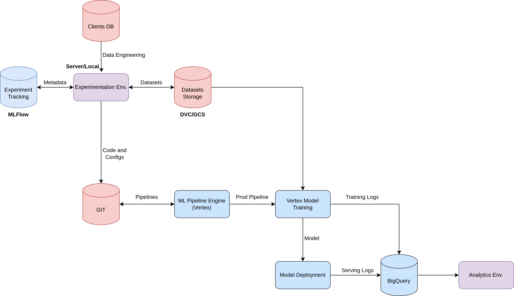

# Projeto Engenharia de Machine Learning
This repository has the idea to build a first cut of a MLOps pipeline end to end in VertexAI.

The overview architecture of the project is this:



## Problem Statement:

As toy a example, we are trying to solve the problem of default payment risk prediction.
The dataset for the problem can be found [here.](https://archive.ics.uci.edu/ml/datasets/default+of+credit+card+clients)

To do that I will follow the these steps:

1. Data analysis to understand the problem and the dataset;
2. Baseline machine learning model for classification;
3. More complex machine learning model for classification;
4. Development of Vertex Pipeline for training and deployment;
5. BigQuery Table creation for model metada storage;
6. Devolopment of custom prediction image to deal with preprocessing in prediction time;
7. Setup of Vertex Model monitoring for data and concept drifts.

## Running the Pipeline:

To run the pipeline first you need to have a GCP service account with all the required permissions.

Once the service account is ready you can set the bucket with the data using the parameter_values.json in the field **input_path**. Notice, the path must be a GCS FUSE path to the .csv file contaning the training the data.

After that, you can it by:

``` 
python run_pipeline.py --service_account yoursa@project_id.iam.gserviceaccount.com
```
